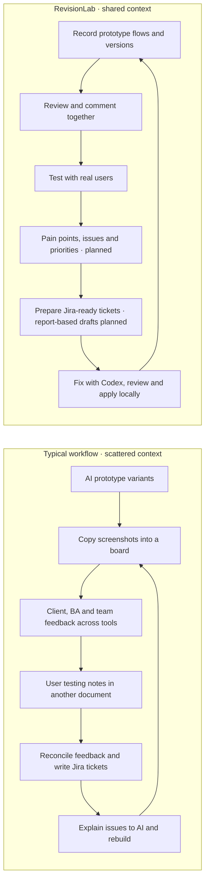

# RevisionLab

**Prototype fast. Learn together. Build what people need.**

RevisionLab brings prototype flows, versions, and feedback into one shared review workspace inside your Next.js project.

## Why it exists

AI made prototyping faster. Keeping everyone aligned became the struggle: clients, business analysts, designers, and developers brought different variants, comments, and priorities across chats, boards, and documents.

RevisionLab brings that conversation back to the prototype. The goal is to **save money through less duplicated work and fewer review tools**, while helping the whole team collaborate with **human-centred design (HCD)** in mind: understand people's needs, test with real users, and let evidence guide the next revision.

## From scattered feedback to shared understanding



The RevisionLab diagram shows the intended end-to-end workflow; planned steps are labelled.

## One place to learn, decide, and improve

| Work together | What RevisionLab provides |
| --- | --- |
| **Start with an overview** | Default workspace Overview presents the same review/inventory counts in an integrated neutral layout with blue accents, with a segmented comment-resolution gauge and tickets in a right rail. The sidebar workspace dropdown stays visible even with one workspace, labels this installation Local workspace, and shows connection-status dots. A shared navbar button shows relative successful sync time, refreshes the selected scope manually, and exposes the exact timestamp in a tooltip. Brief update cues respect reduced motion. Resolved threads earn a quiet acknowledgement with a View comments shortcut. Jira drafts are copied manually and do not create tickets. |
| **See the same journey** | Recorded screens, flow whiteboards, personas, versions, and connected workspaces for the same project. |
| **Keep feedback in context** | Comments and replies on live components, captured screens, and flow paths. |
| **Learn from real people** | Share expiring test links, record participant sessions, inspect time/click metrics, and replay their journeys. Structured findings are planned. |
| **Turn evidence into work** | **Feedback Review** groups repeated comments, previews screenshots with zoom, and uses local Codex with reusable Markdown templates to draft tickets from comments, accessibility findings, and test evidence. Fixed tickets retain their evidence and hide linked comments. Individual screen drafts remain available. Full structured testing/flow reports are planned. |
| **Close the loop** | **Fix with Codex** sends screen feedback to your local Codex CLI in one click; review the proposed changes before applying them. |

**Status:** this describes the repository's local build; some features are not yet published. Test sessions, replay, and Feedback Review ticket drafts are implemented locally; full structured findings and report-based prioritisation remain planned. Jira drafts are copied into Jira manually. Codex fixes and ticket generation require owner/editor access on localhost in development and a signed-in Codex CLI.

Open **Test sessions** and choose **Create a test session** in its header to set a time limit, share its link, and review the saved flow and replay in **Test sessions**; see the [test-session guide](WORKSPACE_GUIDE.md#prototype-test-sessions) for privacy and recording limits.

## A look inside


*Replace these placeholders with real captures of the flow whiteboard and screen review.*

## Try it

In an existing Next.js App Router project:

```bash
npx revisionlab@latest init
npm run dev
```

To try this repository's local build:

```bash
yarn install
yarn dev
```

Open the URL printed by Next.js, complete **Setup**, and record your first flow. The npm release may have fewer features than the local build; see the [installation guide](WORKSPACE_GUIDE.md#install-in-another-nextjs-project) for local-package instructions.

## Go deeper

[Workspace guide](WORKSPACE_GUIDE.md) · [Package integration](packages/revisionlab/README.md) · [Product specification](PRODUCT.md) · [Roadmap](PLAN.md) · [Validation](VALIDATION.md) · [Releases](RELEASING.md)
