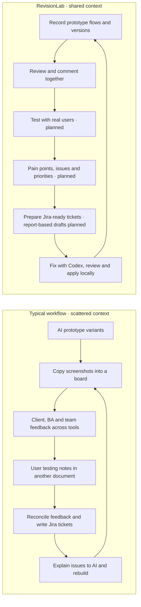

# RevisionLab

**Prototype fast. Learn together. Build what people need.**

RevisionLab brings prototype flows, versions, and feedback into one shared review workspace inside your Next.js project.

## Why it exists

AI made prototyping faster. Keeping everyone aligned became the struggle: clients, business analysts, designers, and developers brought different variants, comments, and priorities across chats, boards, and documents.

RevisionLab brings that conversation back to the prototype. The goal is to **save money through less duplicated work and fewer review tools**, while helping the whole team collaborate with **human-centred design (HCD)** in mind: understand people's needs, test with real users, and let evidence guide the next revision.

## From scattered feedback to shared understanding



The RevisionLab diagram shows the intended end-to-end workflow; planned steps are labelled.

## One place to learn, decide, and improve

| Work together | What RevisionLab provides |
| --- | --- |
| **See the same journey** | Recorded screens, flow whiteboards, personas, versions, and connected workspaces for the same project. |
| **Keep feedback in context** | Comments and replies on live components, captured screens, and flow paths. |
| **Learn from real people** | Planned: create usability tests with real users and consolidate findings alongside team feedback. |
| **Turn evidence into work** | Markdown review reports and editable Jira drafts for individual comments/accessibility issues. Planned: testing/flow reports with pain points, issues, priorities, and ticket drafts. |
| **Close the loop** | **Fix with Codex** sends screen feedback to your local Codex CLI in one click; review the proposed changes before applying them. |

**Status:** this describes the repository's local build; some features are not yet published. Usability-test creation and report-based prioritisation/tickets are planned. Current Jira drafts are copied into Jira manually. Codex fixes require owner/editor access on localhost in development and a signed-in Codex CLI.

## A look inside


*Replace these placeholders with real captures of the flow whiteboard and screen review.*

## Try it

In an existing Next.js App Router project:

```bash
npx revisionlab@latest init
npm run dev
```

To try this repository's local build:

```bash
yarn install
yarn dev
```

Open the URL printed by Next.js, complete **Setup**, and record your first flow. The npm release may have fewer features than the local build; see the [installation guide](WORKSPACE_GUIDE.md#install-in-another-nextjs-project) for local-package instructions.

## Go deeper

[Workspace guide](WORKSPACE_GUIDE.md) · [Package integration](packages/revisionlab/README.md) · [Product specification](PRODUCT.md) · [Roadmap](PLAN.md) · [Validation](VALIDATION.md) · [Releases](RELEASING.md)
