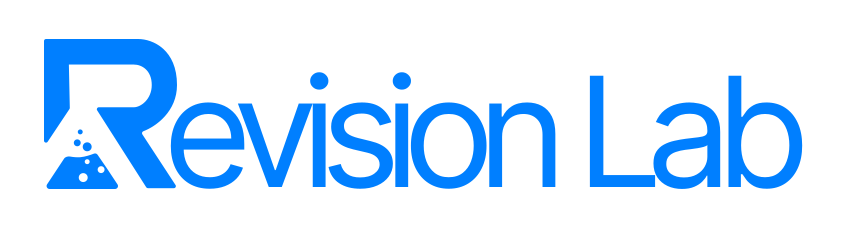
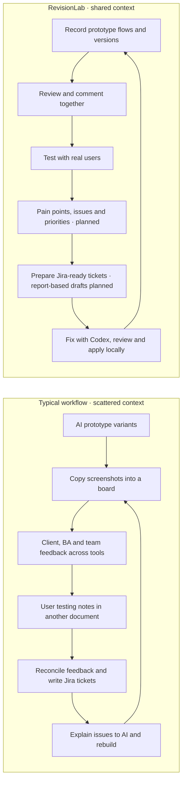
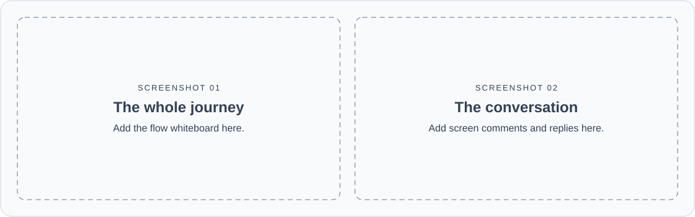

# RevisionLab

**Prototype fast. Learn together. Build what people need.**

RevisionLab brings prototype flows, versions, and feedback into one shared review workspace inside your Next.js project.

## First-use setup

Implemented locally, not yet published: the wizard lets the owner name the workspace, optionally generate an API key under Advanced options, preview the actual widget and live-comment bubbles, choose the WCAG version and A/AA/AAA target, and add personas from a compact table. The wizard and workspace persona forms use an avatar select with portrait options. On the Personas page, the chevron beside **New persona** opens the built-in templates; choosing one fills an editable form and saves only when **Save persona** is pressed. Email and Slack use segmented controls that reveal only the selected configuration. See the [package setup guide](packages/revisionlab/README.md) for details.

## Comment attachments, personas, and mentions

Implemented locally 8 October 2026; not yet published. Use the compact paperclip to upload files, or paste files/images into the comment field. Attach up to five files (3 MB each, 10 MB combined), preview/remove them before posting, and download saved attachments. An attachment can be posted without text. The people icon links multiple personas; type `@` or use the @ icon to select a persona or workspace user. Selecting a persona links it to the comment; selecting a user notifies them when posted. Ordinary `@` text without a selected identity does not notify anyone. Uploads and mentions also work in replies and live-element comments.

The sidebar bell shows your recent mentions, with unread counts, **Open comment**, and **Mark as read**. Notifications persist in the recipient's source installation; connected API keys cannot read a user's inbox or impersonate them. Email is attempted through a configured provider, and delivery failure leaves the comment and in-app notification intact. Active members and current invited reviewers appear in the mention picker, with workspace email distinguishing duplicate names. Attachment bytes remain private behind authenticated artifact access and survive history restore; generated ticket drafts retain file evidence after source recording deletion. Older connected installations keep text comments and show guidance to update before using the new controls.

## Why it exists

AI made prototyping faster. Keeping everyone aligned became the struggle: clients, business analysts, designers, and developers brought different variants, comments, and priorities across chats, boards, and documents.

RevisionLab brings that conversation back to the prototype. The goal is to **save money through less duplicated work and fewer review tools**, while helping the whole team collaborate with **human-centred design (HCD)** in mind: understand people's needs, test with real users, and let evidence guide the next revision.

## From scattered feedback to shared understanding



The RevisionLab diagram shows the intended end-to-end workflow; planned steps are labelled.


Empty review pages now use the supplied illustrations for comments, recordings, test sessions, feedback, personas, drafts, and history. Missing captures and unavailable states have matching artwork while keeping their existing guidance and actions. Illustrations are decorative, responsive TSX components using Chakra semantic colors in both themes. Their canvas backgrounds are transparent; the supplied shapes and overlapping object details are preserved. This refinement is implemented locally, not yet published.

## One place to learn, decide, and improve

| Work together | What RevisionLab provides |
| --- | --- |
| **Start with an overview** | Default workspace Overview presents the same review/inventory counts in an integrated neutral layout with blue accents, with a segmented comment-resolution gauge and tickets in a right rail. The sidebar workspace dropdown stays visible even with one workspace, labels this installation Local workspace, and shows connection-status dots. An error toast warns when the selected workspace stops syncing; automatic retries retain last-loaded content. Workspace scope stays in the sidebar selector, with no top scope badge or sync button. Brief update cues respect reduced motion. Resolved threads earn a quiet acknowledgement with a View comments shortcut. Jira drafts are copied manually and do not create tickets. |
| **See the same journey** | Recorded screens, flow whiteboards, personas, versions, and connected workspaces for the same project. |
| **Keep feedback in context** | Comments and replies on live components, captured screens, and flow paths. |
| **Learn from real people** | Share expiring test links, record participant sessions, inspect time/click metrics, and replay their journeys. Structured findings are planned. |
| **Turn evidence into work** | **Feedback Review** groups repeated comments, previews screenshots with zoom, and uses local Codex with reusable Markdown templates to draft tickets from comments, accessibility findings, and test evidence. Fixed tickets retain their evidence and hide linked comments. Individual screen drafts remain available. Full structured testing/flow reports are planned. |
| **Close the loop** | **Fix with Codex** sends screen feedback to your local Codex CLI in one click; review the proposed changes before applying them. |

**Status:** this describes the repository's local build; some features are not yet published. Test sessions, replay, and Feedback Review ticket drafts are implemented locally; full structured findings and report-based prioritisation remain planned. Jira drafts are copied into Jira manually. Codex fixes and ticket generation require owner/editor access on localhost in development and a signed-in Codex CLI.

Owners can choose **+ Add workspace** from the sidebar dropdown to connect another installation in a modal without leaving their review. With only Local workspace, **All workspaces** is hidden; it appears when another workspace is connected.

Use **Dark mode** or **Light mode** beside Settings in the sidebar to switch the review interface’s appearance. The local build uses theme-aware colors and remembers the choice in your browser; review data and permissions stay the same.

Personas opens as a research collection with informative cards, compact search/filter/sort controls, and a remembered list view. Inspect a profile in a side panel, open the full profile to work with evidence, and undo an archive. New persona is the main action; templates remain available beside it.

Settings uses the full content width, with its section tabs in the page header below the title, matching Test sessions. Tabs wrap on narrow screens and preserve unsaved edits when switching sections.

While each workspace page opens, a skeleton matches that page’s layout in the selected theme. Loading areas show only placeholders, including the sidebar and header, with an accessible loading status and reduced-motion support. Loaded content stays visible during background refreshes.

Open **Test sessions** and use the header’s **Current sessions** and **Previous sessions** tabs to switch between waiting/live tests and completed/expired tests. Choose **Create a test session** in the same header to set a time limit and share its link; open a session to review its saved flow and replay. See the [test-session guide](WORKSPACE_GUIDE.md#prototype-test-sessions) for privacy and recording limits.

## A look inside

The example application's `/` is a visual product marketing website. Interactive Northstar Finance demonstrations show a prototype becoming captured flows, contextual evidence, editable ticket drafts, and a human-reviewed change. The examples are fictional local simulations; `/setup` provides installation guidance and `/revisionlab` opens the actual embedded workspace. The host sales page, installation guide, and font assets are public in production; the workspace and APIs retain their existing access guards.



*Replace these placeholders with real captures of the flow whiteboard and screen review.*

Screen review uses route-bearing screen cards, a combined comments/accessibility list with icon filters, side-panel display options, and floating zoom/comment controls. Page/capture links and saved metadata share a compact footer row.

## Try it

In an existing Next.js App Router project:

```bash
npx revisionlab@latest init
npm run dev
```

To try this repository's local build:

```bash
yarn install
yarn dev
```

Open the URL printed by Next.js, complete **Setup**, and record your first flow. The npm release may have fewer features than the local build; see the [installation guide](WORKSPACE_GUIDE.md#install-in-another-nextjs-project) for local-package instructions.

The local example includes a five-page Northstar Finance prototype at `/demo` (also linked from the homepage and setup guide). Start the real widget's recording on `/demo/finance`, then continue through `/demo/applicant`, `/demo/income`, `/demo/review`, and `/demo/confirmation`. Stop and save there to review the complete flow. Fields are prefilled with fictional data, retain edits within the browser tab, and can be reset with **Restart demo**. The confirmation is simulated; no finance application or email is sent. Existing prototype access and recording permissions apply.

## Go deeper

[Workspace guide](WORKSPACE_GUIDE.md) · [Package integration](packages/revisionlab/README.md) · [Product specification](PRODUCT.md) · [Roadmap](PLAN.md) · [Validation](VALIDATION.md) · [Releases](RELEASING.md)

Fast-navigation recording reliability is implemented locally, not yet published. Page visits and connections are journaled before screenshots or audits, so rapid clicks retain intermediate pages. The widget shows passive Capturing/Saving/Ready/Retry progress and offers upload retry. Stop drains pending work; failed saves remain available for Retry saving. Same-origin reloads recover queued metadata/images or show an explicit interrupted capture. Whiteboard and screen review distinguish pending and unavailable images while preserving paths. Normal prototype interaction stays available. Recording remains bounded to 1000 visits, 200 cards including pending placeholders, two concurrent renders and eight queued images; reaching a limit pauses observation visibly so the existing recording can finish. New tabs, cross-origin navigation and query/hash-only routes remain outside this continuity scope.
