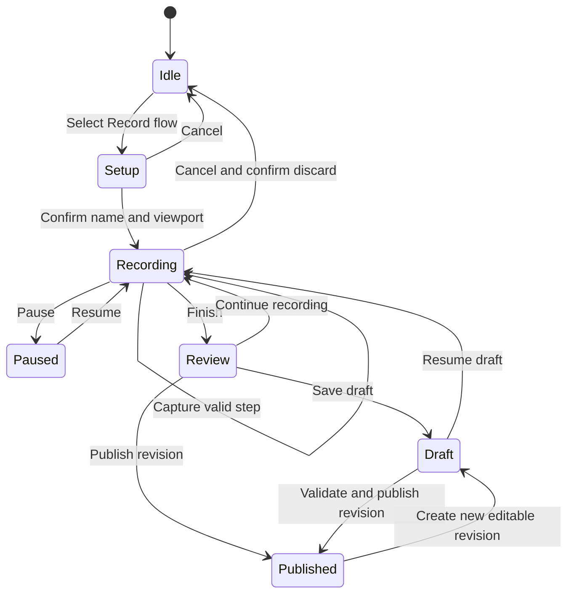
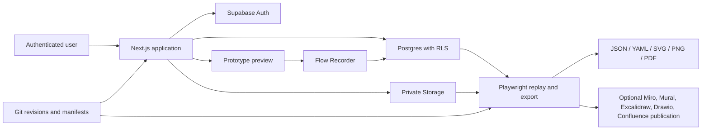

# RevisionLab Product Specification

| Field               | Value                                                                 |
| ------------------- | --------------------------------------------------------------------- |
| Product             | RevisionLab                                                           |
| Document status     | Draft for implementation                                              |
| Version             | 1.0                                                                   |
| Date                | 9 September 2026                                                      |
| Product description | Build, version, record, share, and export responsive prototype flows. |

## 1. Executive summary

RevisionLab is a secure workspace for developing code-based responsive prototypes and preserving how they change over time. It combines a prototype catalogue, responsive preview tools, visual version history, email-based sharing, interaction recording, automated flow replay, and Miro, Mural, Excalidraw, Drawio, Confluence compatible exports.

The product is intended for designers and developers who want the flexibility of real web code without losing the review, sharing, and flow-documentation experience associated with visual design tools. Each prototype is private by default. Owners can grant access to specific email addresses, reviewers can inspect working prototypes without repository access, and authorized users can revisit or compare earlier versions.

A recorder built into the prototype preview captures meaningful interactions using stable element identifiers. Recorded journeys are saved as private drafts, presented as editable step lists and diagrams, and serialized to a versioned JSON or YAML format. The same definition drives automated replay, annotated screenshots, visual flow exports, and optional creation of editable items on a Miro, Mural, Excalidraw, Drawio, Confluence board.

## 2. Problem statement

Responsive prototypes built with web code are realistic and flexible, but their surrounding workflow is fragmented:

- Git records code changes but does not provide a convenient visual history for non-developers.
- Preview deployments show the current build but do not explain the user journey being demonstrated.
- Screenshots document individual states but lose navigation and interaction context.
- Flow diagrams in Miro, Mural, Excalidraw, Drawio, Confluence board are often rebuilt manually and drift from the working prototype.
- Sharing a development URL may expose confidential work or require every reviewer to have repository access.
- Recorded browser sessions are usually video-based and cannot be reused as structured flow data.

RevisionLab brings these activities into one product and uses a single flow definition across recording, replay, review, and export.

## 3. Product vision

RevisionLab should become the place where a prototype's implementation, interaction journeys, review access, and visual history meet.

The core promise is:

> Every prototype can be tested at real responsive sizes, shared securely, revisited at any meaningful revision, and converted into a documented user flow without drawing it again.

## 4. Goals

### 4.1 Primary goals

1. Make code-based prototypes easy to browse and test at multiple responsive sizes.
2. Preserve visual evidence of meaningful revisions alongside Git history.
3. Let owners securely share individual prototypes with named people by email.
4. Record user journeys by interacting with the real prototype.
5. Store recorded flows in a portable, human-readable JSON or YAML format.
6. Show saved flows as both ordered steps and connected diagrams.
7. Replay flows automatically to identify broken or stale interactions.
8. Export screenshots, annotations, and connectors into Miro, Mural, Excalidraw, Drawio, Confluence compatible formats.
9. Keep private prototype data protected at the route, API, database, and asset layers.
10. Support local development, automated testing, and Vercel deployment from one repository.

### 4.2 Secondary goals

- Make adding a new prototype or screen predictable for contributors.
- Provide useful visual regression evidence in pull requests and CI.
- Allow reviewers without Git knowledge to compare versions.
- Keep Miro, Mural, Excalidraw, Drawio, Confluence integration optional so the core application works without the apps credentials.
- Preserve an upgrade path to organizations, richer collaboration, and external integrations.

## 5. Non-goals

The initial product will not:

- Replace Figma as a freeform visual design editor.
- Provide a browser-based source-code editor.
- Replace Git or act as a complete source-control provider.
- Replace Miro, Mural, Excalidraw, Drawio, Confluence as a collaborative whiteboard.
- Capture real production customer sessions.
- Record passwords, form values, network payloads, cookies, or clipboard data.
- Provide anonymous public prototype links in the initial release.
- Provide real-time multiplayer editing of prototype source code.
- Guarantee that downloaded content can be revoked after a recipient has saved a local copy.
- Be used as a repository for production secrets or live customer data.

## 6. Users and roles

### 6.1 Prototype owner

The owner is usually a designer, prototyper, or developer responsible for the prototype. They can manage the prototype, access, versions, flows, downloads, exports, and ownership.

Primary jobs:

- Create and maintain prototype screens.
- Share a private prototype with stakeholders.
- Record representative journeys.
- Publish meaningful flow and prototype revisions.
- Compare proposed changes against previous versions.
- Export an accurate journey to Miro, Mural, Excalidraw, Drawio, Confluence.

### 6.2 Prototype manager

A manager collaborates with the owner on review and documentation without owning the prototype.

Primary jobs:

- Record and maintain flows.
- Manage version notes.
- Invite and remove viewers when permitted.
- Generate exports.
- Publish a flow to Miro, Mural, Excalidraw, Drawio, Confluence with explicit confirmation.

### 6.3 Prototype viewer

A viewer is a stakeholder, researcher, client, engineer, or approver invited to inspect the work.

Primary jobs:

- Open and use the prototype.
- Test it at different responsive sizes.
- Inspect published flows.
- Review and compare permitted versions.
- Download exports only when the owner has allowed viewer downloads.

### 6.4 Outsider

An outsider is signed out or lacks membership for a prototype. They must not be able to discover or access private prototype data, even if they know a route, slug, asset path, database identifier, or flow identifier.

## 7. Product principles

1. **Private by default.** A new prototype is visible only to its owner until access is granted.
2. **Real interaction over simulation.** Responsive previews render the working web prototype rather than scaling screenshots.
3. **Semantic recordings.** Flows refer to stable element identities and screen states rather than fragile coordinates.
4. **One flow definition.** Manual authoring, recording, replay, history, and Miro, Mural, Excalidraw, Drawio, Confluence export share one schema.
5. **Visible history.** Important revisions have screenshots, notes, authorship, and Git context.
6. **Authorization at every layer.** Hiding interface controls is never treated as a security boundary.
7. **Portable output.** Users can retrieve validated JSON, YAML, SVG, PNG, and PDF artifacts.
8. **Useful without integrations.** Miro, Mural, Excalidraw, Drawio, Confluence, cloud deployment, and hosted email delivery enhance the product but do not define the local authoring experience.
9. **Deterministic prototypes.** Test fixtures and stable states make replay and visual comparison trustworthy.

## 8. Terminology

| Term                                                             | Definition                                                                                       |
| ---------------------------------------------------------------- | ------------------------------------------------------------------------------------------------ |
| Prototype                                                        | A collection of implemented screens and states with a stable slug.                               |
| Screen                                                           | A named route or significant UI state within a prototype.                                        |
| Responsive preview                                               | A controlled viewport used to render a live prototype at a specified size.                       |
| Snapshot                                                         | A deterministic screenshot of one screen at one viewport and version.                            |
| Prototype version                                                | A named, immutable collection of screenshots and metadata tied to a Git revision where possible. |
| Authored flow                                                    | A flow definition created or edited directly as JSON or YAML.                                    |
| Recorded flow                                                    | A journey created by interacting with a prototype while recording is active.                     |
| Flow step                                                        | One interaction and its resulting navigation or state change.                                    |
| Flow revision                                                    | An immutable published version of a flow definition.                                             |
| Replay                                                           | Automated execution of a flow against a prototype.                                               |
| Stable target                                                    | A recordable element with a durable identity such as `data-flow-id`.                             |
| Static Miro, Mural, Excalidraw, Drawio, Confluence export        | An SVG, PNG, or PDF imported as visual content.                                                  |
| Editable Miro, Mural, Excalidraw, Drawio, Confluence publication | Separate images, labels, frames, and connectors created through the Miro API.                    |

## 9. Scope and release boundaries

### 9.1 Minimum viable product

The MVP includes:

- Secure account creation, verification, sign-in, password reset, and sign-out.
- Private prototypes and email-based access.
- Owner, manager, and viewer permissions.
- Prototype catalogue and responsive preview.
- Declarative screen and flow registration.
- Version snapshots at standard viewports.
- History and side-by-side version comparison.
- Click and navigation recording using stable element targets.
- Autosaved recording drafts and a Saved Flows area.
- JSON and YAML flow download.
- Playwright flow replay and stale-target detection.
- Annotated screenshots with numbered click hotspots.
- Static SVG, PNG, PDF, and JSON Miro, Mural, Excalidraw, Drawio, Confluence export.
- Optional editable Miro, Mural, Excalidraw, Drawio, Confluence publishing with dry-run and explicit confirmation.
- GitHub Actions and Vercel deployment support.

### 9.2 Subsequent capabilities

Potential later additions include:

- Organization workspaces and shared prototype collections.
- Comments and review annotations.
- Approval states and sign-off workflows.
- Optional anonymous links with passwords and expiry.
- Rich branching-flow editing.
- GitHub pull-request creation from flow changes.
- Notifications through additional email providers or workplace messaging tools.
- Enterprise SSO, SCIM, retention policies, and advanced audit export.
- Research sessions, participant links, and usability metrics.

## 10. Information architecture

### 10.1 Primary routes

| Route                                 | Purpose                                                    |
| ------------------------------------- | ---------------------------------------------------------- |
| `/login`                              | Account sign-in.                                           |
| `/signup`                             | Account creation and verification.                         |
| `/forgot-password`                    | Password-reset request.                                    |
| `/auth/callback`                      | Safe authentication and invitation callback handling.      |
| `/dashboard`                          | Catalogue of prototypes available to the current user.     |
| `/prototypes/[slug]`                  | Prototype overview, access summary, versions, and flows.   |
| `/prototypes/[slug]/preview/[screen]` | Responsive prototype workspace.                            |
| `/prototypes/[slug]/run/[screen]`     | Unframed prototype route.                                  |
| `/prototypes/[slug]/flows`            | Saved authored and recorded flows.                         |
| `/prototypes/[slug]/flows/[flowId]`   | Flow detail, steps, diagram, revisions, and replay health. |
| `/prototypes/[slug]/history`          | Prototype version timeline.                                |
| `/prototypes/[slug]/compare`          | Version and screenshot comparison.                         |
| `/prototypes/[slug]/access`           | Share dialog and access management for authorized users.   |
| `/account`                            | Personal profile and session controls.                     |

### 10.2 Prototype overview

The overview is the central page for a prototype. It shows:

- Title and description.
- Current user's role.
- Private status.
- Screen count.
- Latest prototype version.
- Saved flow count and replay health.
- Recent activity.
- Open Prototype, Record Flow, History, Compare, Export, and Share actions where authorized.

## 11. Core user journeys

### 11.1 Owner bootstraps and registers a prototype

1. The developer configures Supabase locally.
2. They create and verify their account.
3. A trusted command assigns the first owner; there is no public bootstrap endpoint.
4. A synchronization command registers code-defined prototypes using their stable slugs.
5. The owner sees the prototype on the dashboard.

### 11.2 Owner shares a prototype

1. The owner opens Share.
2. They enter an email and choose Can view or Can manage.
3. The server reauthenticates and reauthorizes the owner.
4. Existing users receive membership; new users receive a pending invitation using the configured provider.
5. The recipient authenticates as the exact verified email.
6. The prototype appears on the recipient's dashboard.
7. The action is recorded in the audit log.

### 11.3 Manager records a flow

1. The manager opens a prototype screen at a chosen viewport.
2. They select Record Flow and enter a name.
3. The recorder highlights eligible prototype elements.
4. The manager clicks through the journey normally.
5. Each meaningful interaction is added to the live step list and autosaved.
6. The manager finishes, reviews labels and warnings, and saves a draft or publishes a revision.
7. The flow appears in Saved Flows.

### 11.4 Reviewer compares revisions

1. The reviewer opens History.
2. They choose earlier and later versions, a screen, and a viewport.
3. RevisionLab shows side-by-side, reveal, and pixel-difference views.
4. Missing or incompatible screenshots are clearly identified.

### 11.5 Manager exports to Miro, Mural, Excalidraw, Drawio, Confluence

1. The manager opens a published flow revision.
2. They replay it to create or refresh annotated screenshots.
3. They choose a viewport and export format.
4. RevisionLab lays out one numbered node per journey step with labelled connectors.
5. The manager downloads a static Miro, Mural, Excalidraw, Drawio, Confluence -compatible file or explicitly confirms editable publication to a configured board.

## 12. Functional requirements

### 12.1 Authentication

| ID      | Requirement                                                                            |
| ------- | -------------------------------------------------------------------------------------- |
| AUTH-01 | Users can create an account using email and password.                                  |
| AUTH-02 | Protected access requires a verified email.                                            |
| AUTH-03 | Users can sign in, sign out, request a password reset, and complete a password reset.  |
| AUTH-04 | Sessions use the current recommended Supabase server-side cookie pattern for Next.js.  |
| AUTH-05 | After authentication, users return only to a validated internal destination.           |
| AUTH-06 | Expired or invalid sessions return the user to login without revealing protected data. |
| AUTH-07 | An authenticated user with no prototype memberships sees a useful empty state.         |

### 12.2 Prototype access and sharing

| ID        | Requirement                                                                     |
| --------- | ------------------------------------------------------------------------------- |
| ACCESS-01 | Every prototype is private when registered.                                     |
| ACCESS-02 | Owners can invite an email with viewer or manager access.                       |
| ACCESS-03 | Invitations are normalized, validated, rate-limited, and idempotent.            |
| ACCESS-04 | Duplicate active invitations and memberships are prevented.                     |
| ACCESS-05 | Owners can resend, revoke, or change permitted access.                          |
| ACCESS-06 | Managers can manage viewers but cannot grant ownership or escalate themselves.  |
| ACCESS-07 | Owners cannot accidentally remove or downgrade themselves.                      |
| ACCESS-08 | Ownership transfer is explicit, reauthorized, confirmed, and audited.           |
| ACCESS-09 | Copying a prototype link never bypasses authentication or authorization.        |
| ACCESS-10 | Viewer export downloads obey the prototype's owner-controlled download setting. |

### 12.3 Prototype catalogue

| ID       | Requirement                                                                                                                 |
| -------- | --------------------------------------------------------------------------------------------------------------------------- |
| PROTO-01 | The dashboard lists only prototypes available to the current user.                                                          |
| PROTO-02 | Each item shows title, description, role, screen count, latest version, and last update.                                    |
| PROTO-03 | Unauthorized prototype names, slugs, flows, and counts are not disclosed.                                                   |
| PROTO-04 | A synchronization command registers definitions by stable slug without silently changing ownership or deleting memberships. |

### 12.4 Responsive preview

| ID         | Requirement                                                                                |
| ---------- | ------------------------------------------------------------------------------------------ |
| PREVIEW-01 | Presets include phone at 375 px, tablet at 768 px, and desktop at 1280 px.                 |
| PREVIEW-02 | Users can enter a valid custom width.                                                      |
| PREVIEW-03 | Users can rotate relevant presets, fit the preview, or open the unframed route.            |
| PREVIEW-04 | The current dimensions and screen name remain visible.                                     |
| PREVIEW-05 | Previous and next controls follow the declared screen order when applicable.               |
| PREVIEW-06 | The prototype responds to its real viewport or container width and is not visually scaled. |
| PREVIEW-07 | Preview shell interactions are visually distinct from prototype interactions.              |

### 12.5 Prototype versions and history

| ID         | Requirement                                                                               |
| ---------- | ----------------------------------------------------------------------------------------- |
| VERSION-01 | An authorized user can capture every configured screen at standard viewports.             |
| VERSION-02 | A version records its name, creator, date, notes, Git commit, and snapshot manifest.      |
| VERSION-03 | Published version records and referenced assets are immutable.                            |
| VERSION-04 | Version commands do not automatically commit or create Git tags.                          |
| VERSION-05 | Protected screenshots are never placed in the public web directory.                       |
| VERSION-06 | The history page displays an ordered version timeline and missing-asset states.           |
| VERSION-07 | A local command can generate a version snapshot without a manually managed second server. |

### 12.6 Visual comparison

| ID         | Requirement                                                                                             |
| ---------- | ------------------------------------------------------------------------------------------------------- |
| COMPARE-01 | Users can choose earlier version, later version, screen, and viewport.                                  |
| COMPARE-02 | Comparison modes include side by side, draggable reveal or overlay, and pixel difference.               |
| COMPARE-03 | Difference generation uses images with compatible dimensions or explains why comparison is unavailable. |
| COMPARE-04 | A command can generate a local comparison report under `exports/comparisons/`.                          |

### 12.7 Flow recording

| ID        | Requirement                                                                                                    |
| --------- | -------------------------------------------------------------------------------------------------------------- |
| RECORD-01 | Owners and managers can start a named recording from the responsive preview.                                   |
| RECORD-02 | Recording setup captures the start screen and selected viewport.                                               |
| RECORD-03 | The toolbar provides recording status, step count, pause, resume, undo, finish, and cancel.                    |
| RECORD-04 | Clicks inside the prototype are recorded without preventing their original behavior.                           |
| RECORD-05 | Preview-shell controls are never recorded.                                                                     |
| RECORD-06 | The preferred target identity is a unique `data-flow-id`.                                                      |
| RECORD-07 | Accessible role and name may be used as an unambiguous fallback.                                               |
| RECORD-08 | Fragile targets receive a warning and cannot be silently presented as stable.                                  |
| RECORD-09 | Route and named state changes are connected to the initiating interaction.                                     |
| RECORD-10 | Drafts autosave after accepted steps and recover after refresh.                                                |
| RECORD-11 | Duplicate events from one click are deduplicated.                                                              |
| RECORD-12 | Recording stops safely when the session expires or access is revoked.                                          |
| RECORD-13 | Sensitive input values, credentials, browser storage, clipboard data, and network payloads are never captured. |

### 12.8 Flow review and storage

| ID      | Requirement                                                                                                       |
| ------- | ----------------------------------------------------------------------------------------------------------------- |
| FLOW-01 | The prototype contains a Saved Flows list with status, step count, author, viewport, revision, and replay health. |
| FLOW-02 | Flow detail supports a step timeline and graph view.                                                              |
| FLOW-03 | Authorized users can edit labels, outcomes, step order, and permitted connections.                                |
| FLOW-04 | Published flow revisions are immutable.                                                                           |
| FLOW-05 | Viewers can see published flows but not private drafts.                                                           |
| FLOW-06 | JSON and YAML exports serialize the same validated logical definition.                                            |
| FLOW-07 | Local pull and push commands synchronize definitions without overwriting a newer revision silently.               |
| FLOW-08 | The schema is explicitly versioned and supports future migrations.                                                |

### 12.9 Replay

| ID        | Requirement                                                                                                                         |
| --------- | ----------------------------------------------------------------------------------------------------------------------------------- |
| REPLAY-01 | Playwright can replay a selected flow revision from its declared start screen.                                                      |
| REPLAY-02 | Replay locates stable targets and fails safely on missing or ambiguous targets.                                                     |
| REPLAY-03 | Each step verifies its starting context and expected result.                                                                        |
| REPLAY-04 | Replay statuses include passed, warning, missing target, ambiguous target, unexpected destination, timeout, and unsupported action. |
| REPLAY-05 | Prototype changes that break a target mark the flow stale.                                                                          |
| REPLAY-06 | Replays use deterministic fixtures and do not operate on live customer data.                                                        |
| REPLAY-07 | Successful replay can produce numbered click-hotspot screenshots.                                                                   |

### 12.10 Miro export

| ID        | Requirement                                                                                                                   |
| --------- | ----------------------------------------------------------------------------------------------------------------------------- |
| EXPORT-01 | Static export generates self-contained SVG, PNG, PDF, JSON, YAML, and individual screen images.                               |
| EXPORT-02 | A sequential recorded flow creates one numbered visual node per recorded visit, including repeated screens.                   |
| EXPORT-03 | Nodes show screen title, screenshot, hotspot, action label, and expected result.                                              |
| EXPORT-04 | Connectors show direction and recorded action labels.                                                                         |
| EXPORT-05 | Branches and cycles use a stable, readable layout.                                                                            |
| EXPORT-06 | Hosted generation and downloads require current prototype authorization.                                                      |
| EXPORT-07 | Editable Miro, Mural, Excalidraw, Drawio, Confluence publishing defaults to dry-run and requires explicit confirmation.       |
| EXPORT-08 | Miro, Mural, Excalidraw, Drawio, Confluence credentials stay server-side and are never logged or persisted in exports.        |
| EXPORT-09 | Publication creates new content without deleting or replacing unrelated board content.                                        |
| EXPORT-10 | Missing Miro, Mural, Excalidraw, Drawio, Confluence credentials do not break prototypes, recording, replay, or static export. |

## 13. Permission matrix

| Capability                                             | Owner |    Manager    |   Viewer   | Outsider |
| ------------------------------------------------------ | :---: | :-----------: | :--------: | :------: |
| Open prototype                                         |  Yes  |      Yes      |    Yes     |    No    |
| View published history                                 |  Yes  |      Yes      |    Yes     |    No    |
| Compare permitted versions                             |  Yes  |      Yes      |    Yes     |    No    |
| View published flows                                   |  Yes  |      Yes      |    Yes     |    No    |
| View flow drafts                                       |  Yes  |      Yes      |     No     |    No    |
| Record or edit a flow                                  |  Yes  |      Yes      |     No     |    No    |
| Publish a flow revision                                |  Yes  |      Yes      |     No     |    No    |
| Create a prototype version                             |  Yes  |      Yes      |     No     |    No    |
| Download exports                                       |  Yes  |      Yes      | If enabled |    No    |
| Publish to Miro, Mural, Excalidraw, Drawio, Confluence |  Yes  |      Yes      |     No     |    No    |
| Invite viewers                                         |  Yes  |      Yes      |     No     |    No    |
| Invite managers                                        |  Yes  | No by default |     No     |    No    |
| Remove viewers                                         |  Yes  |      Yes      |     No     |    No    |
| Manage managers                                        |  Yes  |      No       |     No     |    No    |
| Change viewer-download setting                         |  Yes  |      No       |     No     |    No    |
| Transfer ownership                                     |  Yes  |      No       |     No     |    No    |
| Delete prototype                                       |  Yes  |      No       |     No     |    No    |

## 14. Recorder interaction model

### 14.1 Recorder states



### 14.2 Recordable target contract

Prototype elements should use:

```html
<button data-flow-id="continue-to-details" data-flow-label="Continue to your details">
	Continue
</button>
```

Supported attributes:

| Attribute             | Purpose                                                            |
| --------------------- | ------------------------------------------------------------------ |
| `data-flow-id`        | Stable unique target identity within the screen.                   |
| `data-flow-label`     | Human-readable action label.                                       |
| `data-flow-ignore`    | Excludes an element and its intended interaction.                  |
| `data-flow-sensitive` | Prevents inspection or recording of sensitive interaction details. |
| `data-screen-id`      | Identifies the current screen or named UI state where needed.      |

The recorder may store a normalized point inside the target for visual annotation, but replay must use semantic identity rather than coordinates.

### 14.3 Iframe bridge

When the preview uses an iframe, the shell and prototype must remain same-origin. Structured recorder events are sent to the host using a narrowly scoped bridge. The host validates:

- Exact origin.
- Expected iframe window.
- Active recording session identifier.
- Message type and schema.
- Prototype and screen context.

Wildcard production origins are prohibited. The recorder bridge remains inactive until an authorized session begins.

## 15. Unified flow schema

The following illustrates the portable schema. The production schema must have runtime validation and generated TypeScript types.

```yaml
schemaVersion: 1
id: checkout-happy-path
prototypeId: checkout
name: Checkout happy path
description: Complete a standard card purchase
status: published
revision: 3
startScreenId: basket

viewport:
  name: desktop
  width: 1280
  height: 900

steps:
  - id: step-1
    order: 1
    action: click
    fromScreenId: basket
    target:
      flowId: continue-to-delivery
      role: button
      accessibleName: Continue
      label: Continue to delivery
      normalizedPoint:
        x: 0.5
        y: 0.5
    routeBefore: /prototypes/checkout/basket
    toScreenId: delivery
    routeAfter: /prototypes/checkout/delivery
    outcome: Delivery screen opens
    screenshotRef: step-1-before.png
    unstableTarget: false

  - id: step-2
    order: 2
    action: click
    fromScreenId: delivery
    target:
      flowId: confirm-address
      role: button
      accessibleName: Confirm address
      label: Confirm address
    routeBefore: /prototypes/checkout/delivery
    toScreenId: payment
    routeAfter: /prototypes/checkout/payment
    outcome: Payment screen opens
    screenshotRef: step-2-before.png
    unstableTarget: false

connections:
  - fromStepId: step-1
    toStepId: step-2
    label: Continue to delivery
```

### 15.1 Supported actions

Required actions:

- `click`
- `navigate`
- `open`
- `close`
- `select`

Optional form support may record `fill` without storing the entered value. A safe fixture reference can be used:

```yaml
action: fill
target:
  flowId: email-address
value: "[REDACTED]"
fixtureKey: test-user-email
```

### 15.2 Validation rules

- Flow IDs and slugs are unique within a prototype.
- Screen and step IDs are unique.
- The start screen exists.
- The flow contains at least one step before publication.
- Step ordering is valid and deterministic.
- Referenced screen IDs exist.
- Connections reference existing steps.
- Routes are internal, normalized prototype routes.
- Viewport dimensions are within configured limits.
- Target identifiers are valid and unique within a screen.
- Sensitive query parameters and fragments are stripped unless allowlisted.
- Exported files contain no account emails, database user IDs, credentials, cookies, or tokens.
- Duplicate interaction events are rejected.

## 16. Data model

### 16.1 Core tables

| Table                     | Purpose                                                           |
| ------------------------- | ----------------------------------------------------------------- |
| `profiles`                | Private user profile and normalized email mapping.                |
| `prototypes`              | Stable prototype identity, owner, metadata, and download setting. |
| `prototype_members`       | User membership and viewer or manager role.                       |
| `prototype_invitations`   | Pending, accepted, expired, and revoked email invitations.        |
| `prototype_versions`      | Immutable version metadata and private asset manifest.            |
| `recorded_flows`          | Current editable flow metadata and validated JSON definition.     |
| `recorded_flow_revisions` | Immutable published flow definitions and replay status.           |
| `audit_events`            | Append-only record of security-relevant operations.               |

### 16.2 Important constraints

- Each prototype has exactly one owner.
- Prototype slugs are unique.
- A user has at most one membership per prototype.
- Roles use a database enum or checked value set.
- Active invitations are unique per normalized email and prototype.
- Published prototype versions are unique by prototype and version name.
- Flow slugs are unique within a prototype.
- Flow revisions increase monotonically and are immutable.
- Audit events cannot be edited by ordinary clients.

### 16.3 Private assets

Hosted screenshots and exports live in a private Supabase Storage bucket. Object paths include opaque prototype and version identifiers rather than guessable public URLs. Access requires a fresh server authorization check followed by an authenticated stream or short-lived signed URL.

Local assets live outside the Next.js `public/` directory. Version manifests can be committed to Git. Confidential repositories and CI artifacts must remain private.

## 17. Technical architecture

### 17.1 Components

- **Next.js App Router:** Application UI, protected routes, server components, server actions, and route handlers.
- **Supabase Auth:** Verified identities, invitation onboarding, password reset, and sessions.
- **Supabase Postgres:** Prototype, permission, version, flow, and audit metadata.
- **Postgres Row Level Security:** Database-enforced authorization and tenant isolation.
- **Supabase private Storage:** Hosted snapshots and exports.
- **Storybook:** Isolated development of components, screens, and states.
- **Playwright:** Responsive capture, visual regression, journey replay, and annotated screenshots.
- **Git and GitHub:** Source history, version manifests, reviews, and CI.
- **Vercel:** Application and protected preview deployments.
- **Miro, Mural, Excalidraw, Drawio, Confluence REST API:** Optional editable publication of flow items and connectors.

### 17.2 System data flow



### 17.3 Source of truth

- Prototype implementation and screen registry: Git.
- Authenticated user identity: Supabase Auth.
- Current membership and authorization: Postgres with RLS.
- Flow draft: protected database record.
- Published flow revision: immutable database record plus portable JSON or YAML.
- Version manifest and Git revision: Git and database metadata.
- Hosted screenshots and exports: private Storage.
- Local generated artifacts: non-public repository directories.

## 18. Security specification

### 18.1 Authorization strategy

Create centralized server-only helpers equivalent to:

```ts
requireUser()
requirePrototypeAccess(prototypeId, capability)
requirePrototypeOwner(prototypeId)
```

Use them for protected pages, server actions, route handlers, asset delivery, downloads, invitations, version creation, flow editing, replay, and Miro, Mural, Excalidraw, Drawio, Confluence publishing.

Next.js proxy or middleware can redirect signed-out users, but it is not the authorization boundary. Row Level Security provides an independent database layer.

### 18.2 Threats and controls

| Threat                        | Required control                                                                              |
| ----------------------------- | --------------------------------------------------------------------------------------------- |
| Broken access control or IDOR | Server authorization and RLS on every protected resource; non-enumerating errors.             |
| Secret leakage                | Server-only environment parsing; no secret-prefixed public variables; bundle tests.           |
| Public screenshot discovery   | Private Storage and authorized delivery; no private assets under `public/`.                   |
| Invitation abuse              | Authorization, validation, rate limiting, cooldowns, expiry, and audit events.                |
| Role escalation               | Server-defined capability matrix; ignore browser-supplied ownership or authority.             |
| CSRF                          | Current framework same-origin and mutation protections; safe POST or server-action semantics. |
| Open redirects                | Allow only validated internal return paths and configured authentication origins.             |
| XSS                           | React escaping, input validation, careful rich-text handling, and Content Security Policy.    |
| Stale sessions                | Server session verification and refresh; fail closed when verification is unavailable.        |
| Recorder data leakage         | Capture allowlisted semantic metadata only; exclude values and sensitive fields.              |
| Cross-frame message spoofing  | Exact origin, window, session, and schema validation.                                         |
| Cached private data           | `private` and `no-store` behavior for protected responses and assets.                         |

### 18.3 HTTP and browser requirements

- Secure and HTTP-only production session cookies.
- Appropriate SameSite behavior.
- Content Security Policy.
- `X-Content-Type-Options: nosniff`.
- Referrer Policy.
- Permissions Policy.
- HSTS in production.
- Same-origin framing support for the internal preview.
- Production source maps disabled unless deliberately justified.
- Sanitized application and CI logs.

### 18.4 Database security

- Enable RLS on every exposed table.
- Revoke broad grants and grant only required operations.
- Use separate policies for select, insert, update, and delete where appropriate.
- Keep administrative secret keys on trusted servers only.
- Protect any security-definer helper with a fixed safe search path and narrow execute grants.
- Test owner, manager, viewer, signed-in outsider, and anonymous behavior.

## 19. Privacy and data handling

- Prototype content should use fictional or explicitly approved test data.
- Recording captures interaction structure, not user-entered values.
- Analytics must not contain screenshot pixels, prototype text, email addresses, or flow contents.
- Email addresses are used for identity and access administration and are not exposed as a global directory.
- Audit events store the minimum information needed to explain security-relevant activity.
- Export files exclude account and credential metadata.
- Deletion and retention behavior must be documented before production launch.
- A user who downloads an authorized export may retain that local copy after access is revoked; the interface must not imply otherwise.

## 20. UX requirements

### 20.1 Visual direction

RevisionLab should feel like a focused professional tool rather than a marketing site. Prioritize:

- Strong information hierarchy.
- Calm neutral surfaces.
- Clear version and access status.
- Compact, familiar controls.
- Visible focus states.
- Limited decorative effects.
- Consistent typography, spacing, and semantic color tokens.

### 20.2 Recorder feedback

- Recording status must remain unmistakable without covering important prototype content.
- Recordable targets receive a subtle hover outline.
- A captured step appears immediately in the side panel.
- Successful autosave is indicated without excessive notifications.
- Unstable targets, failed saves, and stale flows are prominent and actionable.
- Destructive cancellation requires confirmation when unsaved or recorded work exists.

### 20.3 Loading, empty, and failure states

Provide designed states for:

- No prototypes available.
- No saved flows.
- No versions.
- Missing screenshot.
- Expired invitation.
- Access revoked.
- Invalid flow definition.
- Failed autosave.
- Replay failure.
- Missing Miro, Mural, Excalidraw, Drawio, Confluence configuration.
- Miro, Mural, Excalidraw, Drawio, Confluence rate limit or API error.
- Offline or temporarily unavailable backend.

Do not replace the current screen with a blank page during routine loading.

## 21. Accessibility

Target WCAG 2.2 AA for the RevisionLab shell.

Requirements include:

- Complete keyboard access for navigation, preview controls, recorder, flow editor, dialogs, and comparisons.
- Logical focus order and focus restoration after dialogs.
- Visible focus indicators.
- Correct labels, names, roles, and live-region announcements.
- Sufficient text and UI-component contrast.
- Alternatives to color-only status communication.
- Reduced-motion support.
- Screen-reader descriptions for visual comparison and graph states.
- Accessible error summaries for forms.
- Minimum practical pointer targets.

Prototype accessibility remains the prototype author's responsibility, but RevisionLab should provide Storybook and automated checks that help identify problems.

## 22. Responsive behavior

- Dashboard, history, and flow review support desktop, tablet, and mobile viewing.
- The recording workspace is optimized for desktop and landscape tablet use.
- Narrow screens may show the live steps panel as a drawer.
- The preview never silently changes the selected test viewport because the browser window becomes narrower.
- Wide diagrams can pan or zoom without causing page-level horizontal overflow.
- Standard tested widths are 375 px, 768 px, and 1280 px.

## 23. Non-functional requirements

### 23.1 Performance

- Prototype control interactions should respond immediately under normal local conditions.
- Recorder processing must not create perceptible click lag.
- Autosave should begin promptly and show pending or failed status.
- Protected images should be appropriately sized and cached only according to private-content rules.
- Long flow exports should report progress rather than appearing frozen.

### 23.2 Reliability

- Accepted recorded steps are not lost after a confirmed autosave.
- Mutations that may be retried are idempotent.
- Published revisions remain immutable.
- Replay failures do not alter the saved definition.
- Miro, Mural, Excalidraw, Drawio, Confluence failure does not corrupt the local or database export.
- Generated files are written atomically where practical.

### 23.3 Compatibility

- Support current stable Chrome, Edge, Firefox, and Safari for viewing.
- Use standard browser APIs for the recorder.
- Run primary automation in a pinned Chromium environment and add appropriate smoke coverage for WebKit and Firefox.

### 23.4 Observability

Capture structured operational events for:

- Authentication failures without sensitive input.
- Invitation lifecycle.
- Access changes.
- Snapshot and replay completion or failure.
- Export completion or failure.
- Miro, Mural, Excalidraw, Drawio, Confluence publication attempts.

Logs must include correlation identifiers and safe resource identifiers without exposing tokens or private flow contents.

## 24. Success metrics

Initial product metrics should include:

- Time from repository setup to first working prototype.
- Percentage of prototypes with at least one saved version.
- Percentage of started recordings successfully completed.
- Median number of steps per published flow.
- Replay success rate and most common failure category.
- Invitation acceptance rate.
- Time from invitation to first prototype view.
- Version comparison usage.
- Static Miro, Mural, Excalidraw, Drawio, Confluence export success rate.
- Editable Miro, Mural, Excalidraw, Drawio, Confluence publication success rate.
- Number of unauthorized requests correctly denied in automated security tests.

Analytics must record event names and aggregate counts, not private prototype contents.

## 25. Testing strategy

### 25.1 Unit tests

- Flow schema validation and migration.
- Permission matrix.
- Email normalization.
- Route and redirect validation.
- Target selection and duplicate detection.
- Flow layout.
- JSON/YAML equivalence.
- Pixel comparison helpers.
- Environment separation.

### 25.2 Database and policy tests

- Owner, manager, viewer, outsider, and anonymous access.
- Membership insertion and role changes.
- Invitation expiry and revocation.
- Ownership invariants.
- Published revision immutability.
- Private Storage access.
- Audit immutability.

### 25.3 End-to-end tests

- Sign-up, verification test harness, login, logout, and password reset.
- Invitation and exact-email acceptance.
- Direct-route denial and ID substitution attempts.
- Responsive preview at standard widths.
- Complete example prototype flow.
- Record, pause, resume, undo, refresh recovery, finish, and publish.
- Viewer restrictions.
- Replay success and deliberately stale target failure.
- Version snapshot and comparison.
- Static Miro, Mural, Excalidraw, Drawio, Confluence export.
- Miro, Mural, Excalidraw, Drawio, Confluence dry-run without a network write.

### 25.4 Visual tests

- Dashboard and prototype overview.
- Responsive preview shell.
- Share dialog states.
- Recorder toolbar and step panel.
- Saved Flows list and detail.
- History and comparison modes.
- Empty, error, loading, and permission-denied states.

Disable animations, wait for fonts, and use deterministic content when capturing baselines.

## 26. Repository structure

An indicative structure is:

```text
revisionlab/
├── app/
│   ├── auth/
│   ├── dashboard/
│   ├── prototypes/
│   └── api/
├── components/
│   ├── preview/
│   ├── recorder/
│   ├── flows/
│   ├── history/
│   └── sharing/
├── prototypes/
│   ├── registry.ts
│   └── examples/
├── flows/
│   ├── authored/
│   └── recorded/
├── lib/
│   ├── auth/
│   ├── authorization/
│   ├── flow-schema/
│   ├── recorder/
│   ├── replay/
│   ├── export/
│   ├── integrations/
│   └── supabase/
├── private/
│   └── snapshots/
├── exports/
│   ├── comparisons/
│   ├── Miro/
│   ├── Mural/
│   └── Excalidraw/
│   └── Drawio/
│   └── Confluence/
├── scripts/
├── supabase/
│   ├── migrations/
│   ├── seed.sql
│   └── tests/
├── tests/
│   ├── unit/
│   ├── integration/
│   ├── e2e/
│   └── visual/
└── .storybook/
```

Private and generated paths must be reviewed carefully before deployment and source-control decisions are finalized.

## 27. Required commands

```text
pnpm dev
pnpm build
pnpm start
pnpm lint
pnpm typecheck
pnpm test
pnpm storybook
pnpm build-storybook
pnpm flow:validate
pnpm flow:targets:check
pnpm flow:capture
pnpm flow:replay
pnpm flow:pull
pnpm flow:push
pnpm flow:export
pnpm version:snapshot
pnpm version:upload
pnpm compare:versions
pnpm test:visual
pnpm test:visual:update
pnpm db:types
pnpm db:test
pnpm db:sync-prototypes
pnpm auth:bootstrap-owner
pnpm miro:publish
```

Commands that need a local application server should start and stop it automatically. Hosted mutations and Miro publication should default to dry-run where appropriate.

## 28. Delivery plan

### Phase 1: Foundation

- Initialize Next.js, TypeScript, package management, linting, formatting, and testing.
- Create design tokens and the application shell.
- Add server/client environment validation.

### Phase 2: Identity and access

- Implement Supabase SSR authentication.
- Add database migrations, grants, RLS, and generated types.
- Implement first-owner bootstrap.
- Add prototype registration and synchronization.
- Build sharing, roles, invitations, and audit events.

### Phase 3: Prototype workspace

- Create the prototype and screen registry.
- Build catalogue, overview, unframed routes, and responsive preview.
- Add an example onboarding prototype.
- Configure Storybook.

### Phase 4: Version history

- Implement deterministic responsive screenshots.
- Add private asset storage and manifests.
- Build version timeline and comparison modes.
- Add visual test automation.

### Phase 5: Flow recording

- Implement the unified flow schema.
- Add stable target instrumentation and validation.
- Build the iframe recorder bridge, toolbar, live steps, and autosave.
- Add Saved Flows, editing, draft recovery, and immutable revisions.
- Add JSON/YAML synchronization.

### Phase 6: Replay and export

- Implement Playwright replay and replay-health states.
- Generate annotated screenshots.
- Implement graph layout and static Miro, Mural, Excalidraw, Drawio, Confluence export.
- Implement Miro, Mural, Excalidraw, Drawio, Confluence dry-run and optional confirmed publication.

### Phase 7: Hardening and release

- Complete permission, RLS, security, end-to-end, and visual tests.
- Add security headers, rate limits, and sanitized logging.
- Add GitHub Actions and Vercel deployment documentation.
- Verify production builds and protected asset delivery.

## 29. Product acceptance criteria

RevisionLab is ready for its initial release when:

1. The application builds, lints, type-checks, and passes required tests.
2. Storybook builds without production secrets.
3. A verified owner can register and open a prototype.
4. Signed-out users and outsiders cannot access or discover private resources.
5. An owner can invite a viewer by email and later revoke that access.
6. The permission matrix is enforced by both server authorization and RLS.
7. The prototype renders at 375 px, 768 px, 1280 px, and a valid custom width without unintended horizontal overflow.
8. A manager can record a multi-screen journey using stable target identities.
9. Recorder pause, resume, undo, cancel, finish, autosave, and refresh recovery work.
10. Sensitive input values never appear in recordings, logs, or exports.
11. A published flow appears as both an ordered timeline and connected diagram.
12. JSON and YAML representations validate as the same flow.
13. Playwright can replay the example flow and detect a deliberately removed target.
14. An authorized user can create a version snapshot and compare it with another version.
15. Private screenshots and exports are inaccessible through unprotected URLs.
16. Static SVG, PNG, PDF, JSON, and YAML flow exports are generated successfully.
17. The exported diagram retains step order, repeated screen visits, hotspots, labels, and connectors.
18. Miro, Mural, Excalidraw, Drawio, Confluence dry-run performs no network write and reports the planned items.
19. Missing Miro, Mural, Excalidraw, Drawio, Confluence credentials do not break the core application.
20. Setup, authoring, sharing, versioning, recording, replay, export, and deployment are documented.

## 30. Risks and mitigations

| Risk                                                                                     | Mitigation                                                                                           |
| ---------------------------------------------------------------------------------------- | ---------------------------------------------------------------------------------------------------- |
| Prototype changes make recordings brittle.                                               | Require stable flow IDs, validate targets, replay published flows, and report stale steps.           |
| Private assets are accidentally deployed publicly.                                       | Keep them outside `public/`, use private Storage, test direct asset denial, and review build output. |
| RLS becomes complex or recursive.                                                        | Centralize capability rules, use narrow helper functions, and maintain explicit policy tests.        |
| Invitations are used for spam or enumeration.                                            | Restrict invitation authority, rate-limit actions, use generic responses, and audit events.          |
| Visual screenshots are nondeterministic.                                                 | Pin the browser environment, disable motion, load fonts, and use stable fixtures.                    |
| Large histories inflate the repository or deployment.                                    | Keep manifests in Git, store hosted images privately, and define retention or archival later.        |
| Miro, Mural, Excalidraw, Drawio, Confluence layout becomes unreadable for complex flows. | Use stable graph layout, paginate or segment large flows, and preserve downloadable source data.     |
| Recorder captures confidential input.                                                    | Record allowlisted semantic metadata only and aggressively redact form values and routes.            |
| Authorization is applied only in the UI.                                                 | Require centralized server checks and RLS for every protected path and mutation.                     |

## 31. Open product decisions

The following decisions should be resolved before a public production launch:

1. Whether managers may invite other managers or only viewers.
2. Whether invited existing users need a separate notification provider.
3. Whether comments and review annotations belong in the first post-MVP release.
4. The retention and recovery period for deleted prototypes and stored screenshots.
5. Storage limits per prototype and maximum supported flow size.
6. Whether prototype source files and local screenshots are committed normally or through Git LFS.
7. Whether version publication should optionally create a Git tag through an explicit command.
8. Whether organization-level membership should supplement per-prototype access.
9. Whether recording non-navigation clicks is enabled by default.
10. Whether viewers may inspect the visual difference image when downloads are disabled.

## 32. Reference documentation

- [Supabase Auth with Next.js](https://supabase.com/docs/guides/auth/quickstarts/nextjs)
- [Supabase server-side authentication](https://supabase.com/docs/guides/auth/server-side)
- [Supabase user invitations](https://supabase.com/docs/guides/auth/users)
- [Supabase Row Level Security](https://supabase.com/docs/guides/database/postgres/row-level-security)
- [Supabase API key guidance](https://supabase.com/docs/guides/getting-started/api-keys)
- [Storybook viewport configuration](https://storybook.js.org/docs/essentials/viewport)
- [Storybook visual testing](https://storybook.js.org/docs/8/writing-tests/visual-testing)
- [Playwright visual comparisons](https://playwright.dev/docs/test-snapshots)
- [Vercel Git deployments](https://vercel.com/docs/git)
- [Vercel production checklist](https://vercel.com/docs/production-checklist)
- [Miro supported file formats](https://help.miro.com/hc/en-us/articles/360017731613-Supported-file-formats)
- [Miro board items](https://developers.miro.com/docs/board-items)
- [Miro connectors](https://developers.miro.com/docs/work-with-connectors)
